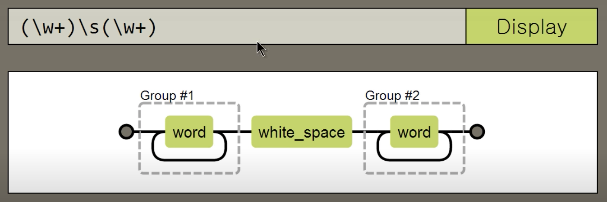

# Javascript와 정규표현식

## 패턴 만들기

1. 정규표현식 리터럴
   * `var pattern = /a/;`
     * `/` 사이에 있는 것을 찾겠다! 는 의미
2. 정규표현식 객체 생성자
   * `var pattern = new RegExp('a');`

---

## RegExp 객체의 사용

### RegExp.exec()

* 인자를 대상으로 RegExp의 정규표현식을 실행하여 결과값을 배열로 리턴한다.
  * 일치하는 대상이 없다면 null을 리턴한다

```JavaScript
var pattern = /a/;
pattern.exec('nana'); // 결과: ["a"]
```

### RegExp.test()

* 인자를 대상으로 RegExp의 정규표현식을 실행하여 true 또는 false를 리턴한다.

```JavaScript
var pattern = /a/;
pattern.test('nykim'); // 결과: false
```

> TIP
> 매개변수/파라미터(parameter): 함수를 실행하기 위해 필요하다고 지정하는 값
> 인수/인자(arguments): 함수를 호출할 때 매개변수로 넘기는 값

---

## String과 정규표현식

### String.match()

* RegExp.exec()와 비슷하다.

```JavaScript
var pattern = /a/;
var a = 'nana'.match(pattern);
console.log(a); // 결과: ["a"]
```

### String.replace()

* 문자열에서 패턴을 검색해 변경한 후 변경된 값을 리턴한다.

```JavaScript
var pattern = /a/;
var a = 'nana'.replace(pattern, 'A');
console.log(a); // 결과: 'nAna'
```

---

## 옵션(i, g)

### i

* 대소문자를 구별하지 않는다

```JavaScript
var pattern = /k/;
var pattern_i = /k/i;
var a = 'nyKim'.match(pattern);
var b = 'nyKim'.match(pattern_i); 
console.log(a); // 결과: null
console.log(b); // 결과: ["K"]
```

### g

* 검색된 모든 결과를 리턴한다

```JavaScript
var pattern = /a/;
var pattern_g = /a/g;
var pattern_ig = /a/ig;
var a = 'nana'.match(pattern); // 결과: ["a"]
var b = 'nana'.match(pattern_g); // 결과: ["a", "a"]
var c = 'nanA'.match(pattern_ig); // 결과: ["a", "A"]
```

---

## 캡처

* `()`는 그룹화하는 데 사용하며 `$1`나 `$2`로 선택할 수 있다
* `\w`는 문자열을 의미 (A-Z, a-z, 0-9)
* `+`는 1개 이상을 의미
* `\s`는 공백(space)를 의미



```JavaScript
var pattern = /(\w+)\s(\w+)/;
var str = "coding everybody";
var result = str.replace(pattern, "$2 $1");
console.log(result); //결과: everybody coding
```

* **참고 사이트**
  * [정규표현식 시각화](https://regexper.com/)
  * [정규표현식 빌더](https://regexr.com/)

---

## 치환

* url을 링크로 치환하는 예제
  
```JavaScript
var urlPattern = /\b(?:https?):\/\/[a-z0-9-+&@#\/%?=~_|!:,.;]*/gim;
var text = '포트폴리오 주소는 https://nykim.net 이고 블로그 주소는 https://nykim.work 입니다 :)';
var result = text.replace(urlPattern, function(url){
    return '<a href="'+url+'">'+url+'</a>';
});
console.log(result);
// 결과: 포트폴리오 주소는 <a href="https://nykim.net">https://nykim.net</a> 이고 블로그 주소는 <a href="https://nykim.work">https://nykim.work</a> 입니다 :)
```
